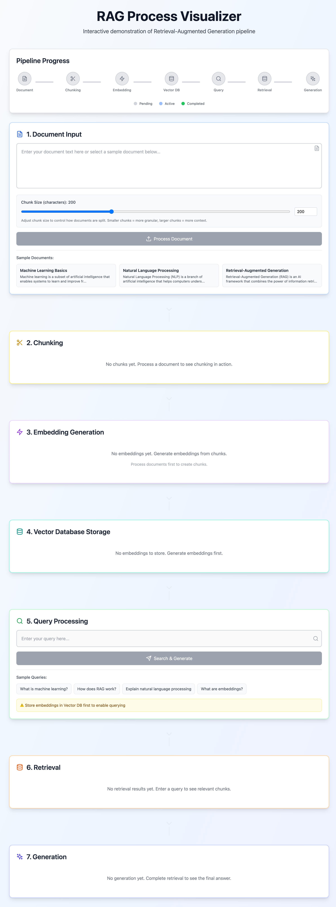

# RAG Process Visualizer

An interactive web application that demonstrates the Retrieval-Augmented Generation (RAG) pipeline. Visualize how documents are processed through chunking, embedding, and intelligent querying.



## 🎥 Demo Video

Watch a complete walkthrough of the RAG pipeline in action:

**📹 [View Demo Video (HTML Player)](./demo.html)** | **📥 [Download Video](./rag-visualizer-demo.webm)** (6.3 MB)

> **Note:** GitHub doesn't support inline video playback. Use the HTML player above or download the video to view it.
> 
> **Direct GitHub link:** [Raw Video File](https://raw.githubusercontent.com/KHemanthRaju/RAG_Visualizer/main/rag-visualizer-demo.webm)

The demo video demonstrates the complete RAG pipeline:
- ✅ **Document Input** - Loading and processing documents with configurable chunk size
- ✅ **Chunking** - Visualizing how documents are split into chunks
- ✅ **Embedding Generation** - Converting chunks to vector embeddings
- ✅ **Vector DB Storage** - Storing embeddings for retrieval
- ✅ **Query Processing** - Entering queries and searching
- ✅ **Retrieval** - Finding relevant chunks with similarity scores
- ✅ **Generation** - Creating responses using retrieved context

### Record Your Own Demo

To create a new demo video:
```bash
# Terminal 1: Start the dev server
npm run dev

# Terminal 2: Run the recording script
node record-demo-improved.js
```

The video will be saved as `rag-visualizer-demo.webm`.

## Features

- **Document Processing**: Upload or input documents to process
- **Chunking Visualization**: See how documents are split into manageable chunks
- **Embedding Generation**: Visualize vector embeddings created from chunks
- **Query Processing**: Enter queries to search through the knowledge base
- **Retrieval Visualization**: See how relevant chunks are retrieved based on similarity
- **Response Generation**: View generated responses grounded in retrieved context

## Getting Started

### Prerequisites

- Node.js 18+ and npm

### Installation

1. Install dependencies:
```bash
npm install
```

2. Run the development server:
```bash
npm run dev
```

3. Open [http://localhost:3000](http://localhost:3000) in your browser

## Live Demo

🌐 **Try it online:** [https://rag-visualizer-azfwfbhan-khemanthrajus-projects.vercel.app](https://rag-visualizer-azfwfbhan-khemanthrajus-projects.vercel.app)

## How It Works

1. **Document Input**: Enter text or select a sample document
2. **Chunking**: Documents are split into smaller chunks (~200 characters)
3. **Embedding**: Each chunk is converted to a high-dimensional vector
4. **Query**: Enter a question or query
5. **Retrieval**: The system finds the most relevant chunks using cosine similarity
6. **Generation**: A response is generated using the retrieved context

## Technology Stack

- **Next.js 14**: React framework with App Router
- **TypeScript**: Type-safe development
- **Tailwind CSS**: Modern styling
- **Framer Motion**: Smooth animations
- **Lucide React**: Beautiful icons

## Project Structure

```
├── app/
│   ├── api/          # API routes for RAG processing
│   ├── page.tsx      # Main application page
│   └── layout.tsx    # Root layout
├── components/       # React components for each stage
└── public/          # Static assets
```

## Notes

This is a demonstration application. The embedding and generation functions use simplified implementations for visualization purposes. In production, you would integrate with:
- Real embedding models (OpenAI, Cohere, etc.)
- Vector databases (Pinecone, Weaviate, etc.)
- LLM APIs (OpenAI GPT, Anthropic Claude, etc.)

## License

MIT


